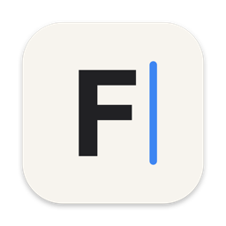
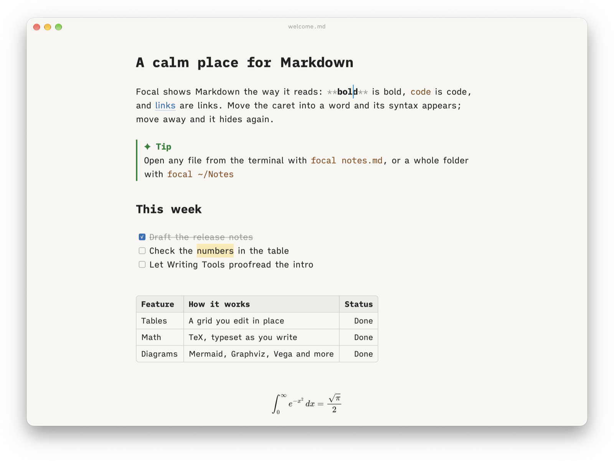
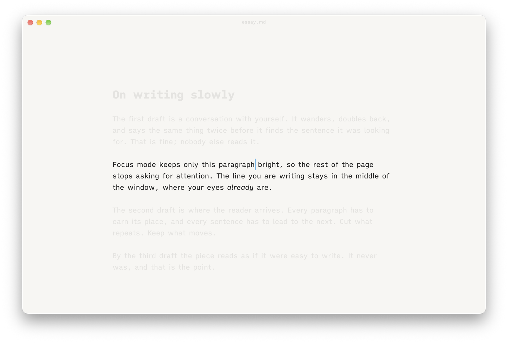
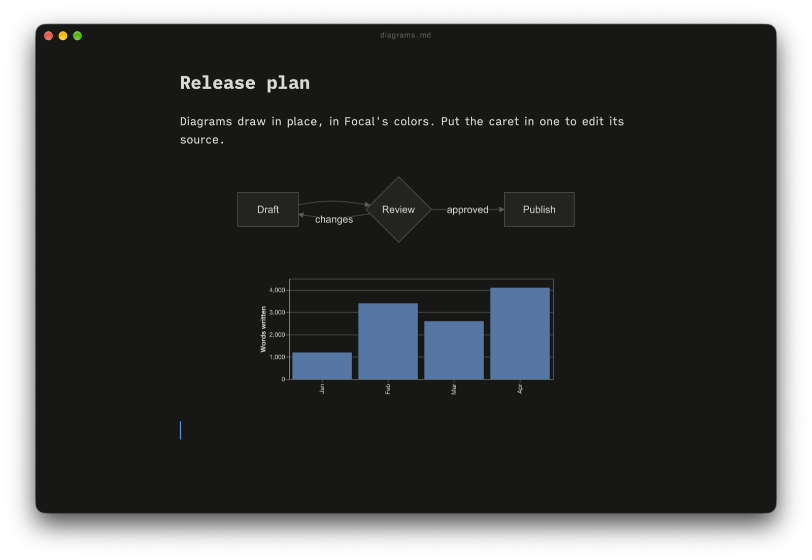
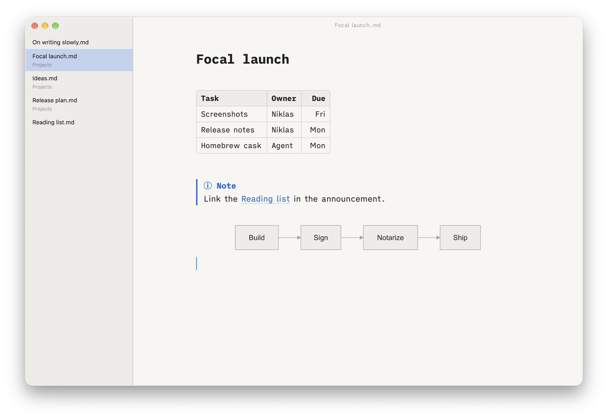

<p align="center">
  
</p>

<h1 align="center">Focal</h1>

<p align="center">
  <b>A calm, native Markdown editor for the Mac that you open from the terminal.</b><br>
  Your <code>.md</code> files, beautifully rendered as you write, and saved exactly as you wrote them.
</p>

<p align="center">
  <a href="https://github.com/niklas-heer/focal/releases/latest">Download</a> ·
  <a href="#install">Install</a> ·
  <a href="#features">Features</a> ·
  <a href="#keyboard-shortcuts">Shortcuts</a> ·
  <a href="docs/design.md">Design</a>
</p>

<p align="center">
  <picture>
    <source media="(prefers-color-scheme: dark)" srcset="docs/images/hero-dark.png">
    
  </picture>
</p>

Focal brings together the calm of [iA Writer](https://ia.net/writer) and the live rendering of [Bear](https://bear.app). Markdown looks the way it will read: headings are headings, tables are tables, math is typeset. Put the caret into a word and its syntax appears so you can edit it; move away and it hides again.

It works on plain Markdown files wherever they live: your notes folder, a Git repository, or the file an agent just wrote. Nothing is imported into a library, and Focal never reformats your text.

## Install

Focal runs on Macs with Apple Silicon and macOS 14 Sonoma or later.

**With Homebrew**, which also puts the `focal` command on your PATH:

```sh
brew install --cask niklas-heer/tap/focal
```

**Or download** the `.zip` from the [latest release](https://github.com/niklas-heer/focal/releases/latest), move `Focal.app` to Applications, and choose **Focal ▸ Install Command Line Tool…** to get the `focal` command.

Focal keeps itself up to date: when a new version is out, it asks before downloading it. You can turn the check off in Settings.

## Use it from the terminal

```sh
focal notes.md          # open a file (it is created when you first save)
focal ~/Notes           # open a folder, with a sidebar of its Markdown files
cat draft.md | focal    # open piped text as a new document
focal --wait msg.md     # wait until the window closes, so it works as $EDITOR
```

Focal runs as one app: every `focal` call opens a window in it, and an open file comes to the front instead of opening twice. In Finder, Focal is offered under **Open With** for Markdown files.

## Features

### Writing

- **Live rendering.** Bold, italics, links, code, highlights, lists, checkboxes, quotes and headings look finished while you type. Syntax shows only where the caret is.
- **Your file stays yours.** What is on disk is the document. Focal styles it on screen and saves your bytes untouched, in their encoding and line endings. Edits save automatically.
- **Live reload.** When Git, an agent or another editor changes the file, Focal reloads it. If you both changed it, it asks which version to keep.
- **Tables you edit as tables.** Every table is a grid. Tab and Return move between cells, rows and columns can be added, moved, deleted and aligned, and the Markdown is rewritten neatly aligned.
- **Spelling, grammar and Apple's Writing Tools.** macOS's own checker underlines misspelled words in red and grammar issues in green, and corrects typos as you finish a word. **Edit ▸ Writing Tools** proofreads, rewrites or summarizes the selection, or the whole document.
- **Find and replace**, **Go to Heading** (⇧⌘O), undo that understands lists and tables, and formatting shortcuts for everything in the bottom bar.
- **Vim and Helix keys**, if your fingers want them: Vim's normal, insert and visual modes with counts, operators, motions, text objects, `.` and `:w`, or Helix's select-then-act editing (`w`, `x`, `mi`, `d`, `c`, `y`). Choose in **Settings ▸ Writing** or **Edit ▸ Editing Keys**; ⌘ shortcuts keep working.

### Focus



**The info panel** (ⓘ in the corner, or ⌥⌘I) counts words, characters, sentences and reading time, tells you about the file, and puts light or dark, the typeface, text size, focus mode and your editing keys one click away. Its **Outline** tab (⌥⌘O) lists the headings; click one to go there.

**Focus mode** (⌘D) fades everything but the sentence or paragraph you are writing, and keeps your line in the middle of the window. The page is a single quiet column in the iA Writer typefaces, in light or dark mode as your Mac is set.

### Diagrams, math and more



Code blocks with a diagram language draw in place, in Focal's colors, light or dark. Put the caret in one to edit its source with a live preview.

- **Diagrams:** Mermaid (all 22 diagram types), Graphviz, Svgbob, Pikchr, WaveDrom, Vega and Vega-Lite, GeoJSON and TopoJSON maps, and STL models, all drawn by Focal itself. D2 and PlantUML work when their tools are installed (see [below](#optional-diagram-tools)).
- **Math:** `$…$`, `$$…$$` and the other common notations, typeset with MathJax.
- **Images**, front matter, footnotes with previews, callouts and alerts, foldable sections, `[[wiki links]]`, tags, emoji shortcodes and tables of contents.

### Folders



Open a folder to get a sidebar of its Markdown files (⌃⌘S), a quick switcher (⌘P), and `[[wiki links]]` between notes. ⌘-click a link to follow it and ⌘[ to come back. A single file gets the sidebar and switcher too, listing the Markdown files beside it.

### Every Markdown dialect

Whatever wrote the file, it should look right. Focal reads GitHub-flavored Markdown, plus what GitLab, Obsidian, Pandoc, MkDocs, Docusaurus, VitePress and Markdown Extra add, the math notations language models use, and README-style HTML. Open [`examples/dialects.md`](examples/dialects.md) to see them side by side.

### Sharing

- **Export as HTML** (⇧⌘E): one standalone page in Focal's typography, with math and diagrams included.
- **Export as PDF** and **Print** (⌥⌘P): the same page laid out for paper.
- **Copy as HTML** (⌥⇧⌘C): paste formatted text, math and diagrams into mail or a word processor.

## Keyboard shortcuts

| Shortcut | Does |
| --- | --- |
| ⌘N, ⌘O | New window, open a file or folder (File ▸ Open Recent lists recent ones) |
| ⌘F, ⌥⌘F | Find, find and replace |
| ⌘G, ⇧⌘G | Next match, previous match |
| ⇧⌘O | Go to a heading |
| ⌘B, ⌘I, ⇧⌘X, ⇧⌘H, ⌘E | Bold, italic, strikethrough, highlight, inline code |
| ⌘K | Insert a link |
| ⌘1 to ⌘6, ⌘0 | Heading level, back to a paragraph |
| ⌘-click, ⌘↩ | Follow a link, wiki link or footnote |
| ⌘[ | Go back |
| ⌘D | Focus mode |
| ⌘=, ⌘− | Bigger or smaller text |
| ⇧⌘L | Switch between light and dark |
| ⌥⌘I, ⌥⌘O | Info panel, outline |
| ⌥⌘R | Show the file in Finder |
| ⌘P | Quick switcher |
| ⌃⌘S | Sidebar |
| ⇧⌘E, ⌥⇧⌘C | Export as HTML, copy as HTML |
| ⌥⌘P | Print (File ▸ Export as PDF… writes a PDF) |
| ⌘, | Settings |

Lists, tasks, quotes, tables, code and math blocks are in the **Format** menu and in the bar that appears when the pointer reaches the bottom of the window.

## Settings

Focal keeps its settings few (⌘,): light, dark or the system's appearance, the typeface for prose (iA Writer Quattro, Duo or Mono, Charter, Georgia, Palatino, Avenir Next, Helvetica Neue, SF Pro, Menlo, Commit Mono, JetBrains Mono, or any font you have) and for code (iA Writer Mono, Commit Mono, JetBrains Mono, Menlo, Monaco, PT Mono, or any monospaced font you have) with a live preview, text size, line length, what focus mode keeps bright, typewriter scrolling, grammar checking, automatic spelling correction, Vim or Helix keys, update checks and the `focal` command.

### Optional diagram tools

Two diagram languages need a tool on your Mac. Without it, their blocks stay code:

| Language | Install |
| --- | --- |
| D2 | `brew install d2` |
| PlantUML | `brew install plantuml` |

With `brew install graphviz`, Graphviz blocks use the real `dot`, which reads every DOT feature. **Settings ▸ Diagrams** shows what your Mac has.

## Privacy

Focal has no accounts and sends no analytics. It goes online only to check for updates (which you can turn off) and to download images a document links to on the web. Diagrams and math are drawn on your Mac. Spelling, grammar and Writing Tools use macOS's own services, which follow your Apple Intelligence and privacy settings.

## Status

Focal is young and used daily by its author. Expect rough edges, and please [open an issue](https://github.com/niklas-heer/focal/issues) when you find one. The [design document](docs/design.md) describes where it is going.

## Building from source

You need an Apple Silicon Mac, [mise](https://mise.jdx.dev) and rustup; the Rust toolchain is pinned in `rust-toolchain.toml`.

```sh
mise run install-app                   # build Focal.app and copy it to /Applications
mise run run -- examples/showcase.md   # run a development build on a file
mise run check                         # formatting, Clippy and tests
mise run stress                        # timings on a 5,000-line document
mise run clean                         # remove debug builds (they are large)
```

Set `FOCAL_TRACE=1` to print parse and restyle times for every change, and `FOCAL_APPEARANCE=light` or `dark` to check one palette regardless of the system.

Focal is written in Rust with [GPUI](https://gpui.rs), the GPU-accelerated UI framework from the [Zed](https://zed.dev) editor, through [GPUI Kit](https://crates.io/crates/gpui-kit). Further reading:

- [Design](docs/design.md): goals, architecture and milestones.
- [Decision records](decisions/): lasting choices and why they were made (managed with [vrdx](https://github.com/niklas-heer/vrdx)).
- [GPUI spike findings](docs/gpui-spike.md) and [TextKit findings](docs/spikes/2026-09-29-m0-textkit.md): how the stack was chosen.
- [RELEASE.md](RELEASE.md): how releases are made. [AGENTS.md](AGENTS.md): guidance for coding agents.

An earlier Focal was an Electron, React and CodeMirror prototype. It stalled on rendering that broke while scrolling and survives in Git history at commit `a72a464`.

## License

[MIT](LICENSE). The bundled iA Writer typefaces are licensed under the [SIL Open Font License 1.1](assets/fonts/LICENSE.md), as are [Commit Mono](assets/fonts/CommitMono-LICENSE.txt) and [JetBrains Mono](assets/fonts/JetBrainsMono-OFL.txt). The icons are [Lucide](https://lucide.dev)'s, under the [ISC license](assets/icons/LICENSE).
