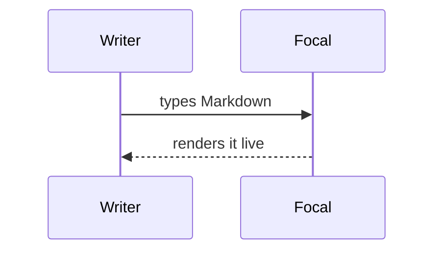
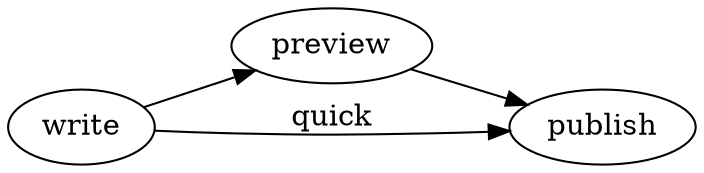
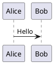

# Diagrams

Every block below draws in place; put the caret in one to edit its source.

## Mermaid



## Graphviz



## Svgbob

```bob
  .---.      .------.
  | A |----->| Bob  |
  '---'      '------'
```

## Pikchr

```pikchr
box "Write" fit; arrow; circle "Read" fit
```

## WaveDrom

```wavedrom
{ signal: [
  { name: "clk",  wave: "P......" },
  { name: "bus",  wave: "x.==.=x", data: ["head", "body", "tail"] }
]}
```

## GeoJSON

```geojson
{"type":"Feature","geometry":{"type":"Polygon","coordinates":[[[13.0,52.3],[13.8,52.3],[13.8,52.7],[13.0,52.7],[13.0,52.3]]]}}
```

## D2 and PlantUML

These draw when `d2` or `plantuml` is installed (`brew install d2 plantuml`); otherwise they stay code.

```d2
write -> preview: live
```


