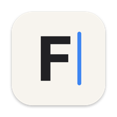

+++
title = "Markdown dialects"
tags = ["compatibility", "showcase"]
+++

<p align="center">
  
</p>
<h1 align="center">Every dialect, at home</h1>

[TOC]

## Math in every notation

Dollars: $e^{i\pi} + 1 = 0$, parentheses: \(a^2 + b^2 = c^2\), and GitLab's $`\sqrt{2}`$.

\[
\int_0^\infty e^{-x^2}\,dx = \frac{\sqrt{\pi}}{2}
\]

```math
\sum_{n=1}^{\infty} \frac{1}{n^2} = \frac{\pi^2}{6}
```

## Callouts

> [!NOTE]
> GitHub's alerts.

> [!tip]- Obsidian with a *written* title
> Any type, folded or not.

> [!faq]- Folded until you open it
> Click ▸ beside the title, or move the caret in.

::: warning Docusaurus and VitePress
A container with **Markdown** inside.
:::

!!! danger "MkDocs"
    An admonition body, indented.

    A second paragraph.

>>>
GitLab's multi-line quote.
>>>

## Pandoc and Markdown Extra

Water is H<sub>2</sub>O, 2^10^ is 1024, and this is the 1^st^ one.

Term
: The definition, indented.

### A heading with attributes {#custom-id .wide}

The HTML spec is long.

*[HTML]: Hyper Text Markup Language

## Obsidian

A %%hidden%% comment, a #tag and a #project/focal tag, and an embed: ![[Some Note]].

![[focal-icon.png|64]]

## Emoji and HTML

Shipped :tada: :rocket: at 10:30:00 — press <kbd>⌘</kbd><kbd>F</kbd> to <mark>find</mark>, <b>bold</b>, <i>italic</i>.

<details>
<summary>More to see</summary>

Hidden until opened, on GitHub.

</details>
