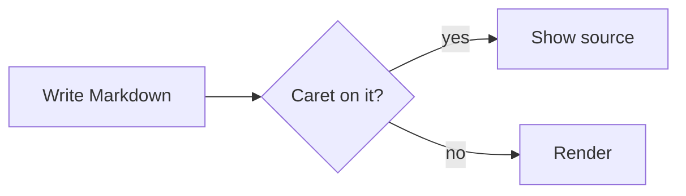

# Focal, in Rust and GPUI

Focal hides Markdown syntax until the caret reaches it. This is **bold**, this is _emphasis_, this is ***both***, and this is `inline code`. You can ~~strike things out~~, ==highlight== them, or link to [the GPUI site](https://gpui.rs). Math like $e^{i\pi} + 1 = 0$ stays inline, and a footnote sits here[^1].

## Lists

- A plain bullet
- A bullet with a much longer line that wraps across the column so we can see how wrapped list items behave when the text keeps going
  - A nested bullet
1. First ordered item
2. Second ordered item

- [ ] An open task
- [x] A finished task

## Lists in depth

1. First
   - nested bullet
     - deeper, with a long line that wraps so the continuation should start under this text rather than under the bullet
2. Second
9. Nine
10. Ten

- [ ] Open task
  - [x] Nested done task

> - A list inside a quote
> - Second item

- A quote inside a list:
  > Quoted under the item

## Quotes and alerts

> A quiet quote, the way iA Writer draws it.
> It can span several lines.

> [!NOTE]
> GitHub alerts get a colored bar and a title.

> [!WARNING]
> Careful with this one.

## Code

```rust
fn main() {
    println!("Hello from a fenced block");
}
```

## Table

| Feature | Status | Notes |
|:--------|:------:|------:|
| Live rendering | **works** | markers hide |
| Tables | grid | click a cell to edit it |
| Mermaid | later | M5 |

Tab and Return move between cells, a right-click shows row and column actions, and the handles drag rows and columns. A wide table scrolls sideways:

| Milestone | Scope | Rendering | Editing | Files | Status |
|:--|:--|:--|:--|:--|:--|
| M1 | Core editor | Live Markdown with markers that hide away from the caret | Lists, checklists, quotes, undo | Open, save, watch for changes | done |
| M2 | Tables | A grid with aligned columns and bold headers | Cells in place, drag to reorder, alignment | Rewritten aligned only when edited | done |
| M3 | Chrome | Bottom bar and focus mode | Typewriter scrolling | Folder mode with a sidebar and quick switcher | next |

> A table can live in a quote:
>
> | Key | Action |
> |:--|:--|
> | ⌘Z | undo |
> | Tab | next cell |

---

Move the pointer to the bottom edge for the formatting bar, or press ⌘D for focus mode.

### A smaller heading

Wiki links like [[design]] resolve against the folder; ⌘-click one, or press ⌘↩ on it, and ⌘[ brings you back. A link to a note that does not exist yet, like [[Someday]], looks quieter and creates it.

Hover the footnote above to preview it.

An image on its own line shows in place of its source:


Display math is typeset:

$$
\int_0^\infty e^{-x^2}\,dx = \frac{\sqrt{\pi}}{2}
$$

Mermaid diagrams are drawn in place, natively:



That's it.

[^1]: Footnotes render as quiet references, and hovering one shows its note.
